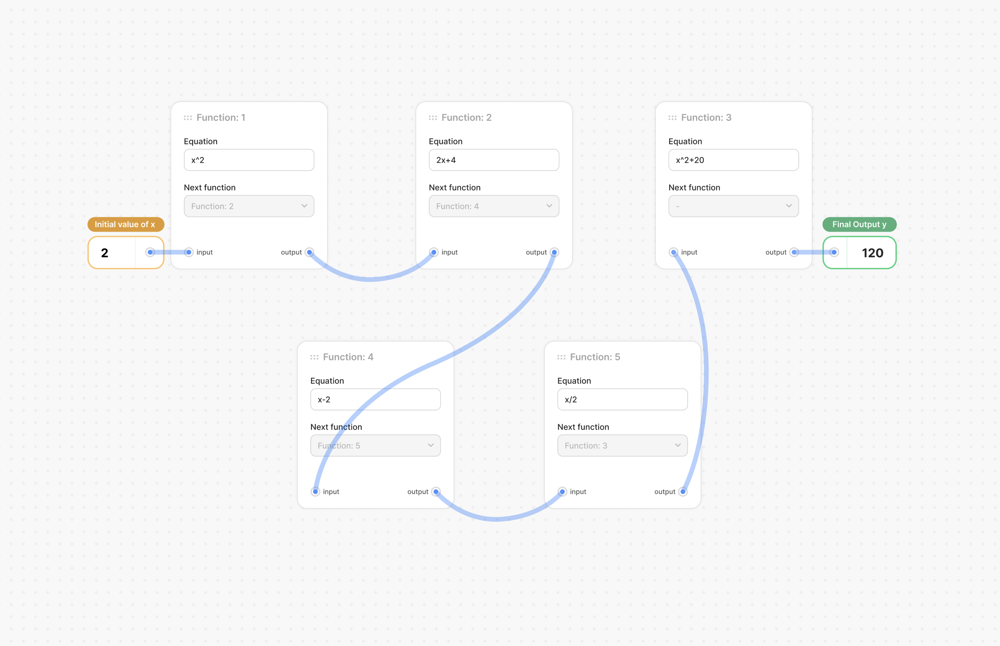

# 🌟 Equation evaluator 🚀

Welcome to the **Equation evaluator**, built using **Vite** ⚡ and **React** 🎨! This project showcases the nested calculation of algebraic equations with the use of dynamic cards 🃏 and interactive connection lines 🔗.

## 📸 UI Preview



## ✨ Features

- 🎴 **Dynamic Cards**: Add, edit, and update cards effortlessly.
- 🔗 **Interactive Connection Lines**: Connect cards dynamically with visually engaging lines.
- 💻 **Responsive Design**: Ensures compatibility across various screen sizes.
- ⚡ **Powered by Vite**: For blazing-fast development and optimized builds.
- 🎨 **Modern React**: Leveraging hooks and functional components for seamless state management.

## 🛠️ Setup & Installation

Follow these steps to get started:

1. **Clone the repository**:

   ```bash
   git clone https://github.com/VivekModiya/equation-evaluator.git
   ```

2. **Navigate to the project directory**:

   ```bash
   cd equation-evaluator
   ```

3. **Install dependencies**:

   ```bash
   yarn install
   ```

4. **Run the development server**:

   ```bash
   yarn
   ```

5. **Open in your browser**:
   Visit [http://localhost:<port_provided_in_console>](http://localhost:3000) 🌐 to see the app in action.

## 🖋️ Usage

- **Initial Value**: Enter an initial value to start the calculations.
- **Add Cards**: Use the interface to dynamically add cards. (Partially supported as adding card is not in scope)
- **Edit Equations**: Modify card equations to update results.

## 📂 Project Structure

```
project-root
├── src
│   ├── app              # Email entry point of the UI
│   ├── assets           # Images, svg, etc.
│   ├── components       # Reusable components like InputBox, OutputBox, etc.
│   ├── utils            # Helper functions for equation evaluation & ordering
│   ├── constants        # Default values & app-wide constants
│   ├── composed         # Composed component made up of customizing multiple base components
│   ├── tokens           # Tokens to standerize the different value
│   ├── constants        # Default values & app-wide constants
│   └── styles           # SCSS modules for styling
├── public               # Static assets
└── vite.config.js       # Vite configuration
```

## 🚀 Technologies Used

- **Frontend**: React ⚛️, TypeScript 🟦
- **Bundler**: Vite ⚡
- **Styling**: SCSS 🎨
- **Utilities**: JavaScript ES6+ ✨

## 🤝 Contributing

We welcome contributions! 🛠️ Feel free to fork the repository, create a feature branch, and submit a pull request. Here are some ways to contribute:

- Report bugs 🐞
- Suggest features 🌟
- Improve documentation 📚

## 🌍 License

This project is licensed under the MIT License 📜. Feel free to use and modify the code.

---

Made with ❤️ and ☕ by Vivek Modiya
